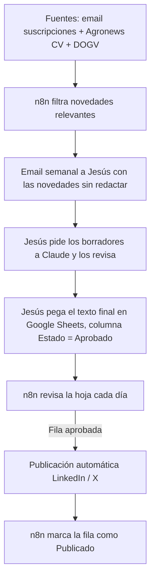

# Arquitectura Técnica — Piloto n8n a coste cero (Fase 2)
## Consultoría Agrícola Integral — Redes Sociales

Documento vivo. Continúa a `01_Estrategia_Contenidos_Redes_Sociales.md`. Define CÓMO se construye el sistema del piloto, con presupuesto 0 €/mes.

Última actualización: 8 de septiembre de 2026.

---

## 0. Alcance del piloto

- **Tecnología:** n8n instalado en local, en tu propio Mac (Community Edition, gratis) — no se usa n8n Cloud.
- **Redacción de borradores:** la sigues pidiendo tú a Claude, con tu suscripción actual — no se conecta ninguna API de IA de pago dentro del flujo.
- **Redes del piloto:** LinkedIn (perfil personal) y X/Twitter. Instagram, Facebook y Threads quedan para una fase posterior.
- **Autonomía:** el sistema no publica nada sin que tú lo hayas redactado y marcado como aprobado.
- **Coste total: 0 €/mes.** El único "coste" es tu tiempo semanal para redactar con Claude y aprobar.

## 1. Qué hace n8n y qué haces tú

n8n se encarga de la parte mecánica y repetitiva; tú te quedas con la parte que requiere criterio (redactar y aprobar):

| Tarea | Quién la hace |
|---|---|
| Vigilar las fuentes (email suscripciones, Agronews, DOGV) | n8n, automático |
| Avisarte de las novedades relevantes | n8n, por email |
| Redactar el borrador por red social | Tú, pidiéndoselo a Claude |
| Aprobar/editar el texto final | Tú |
| Marcar como "aprobado" | Tú, en una hoja de cálculo |
| Publicar en LinkedIn/X | n8n, automático, en cuanto detecta el "aprobado" |
| Registrar el histórico | n8n, automático |

## 2. Flujo completo, de un vistazo

## 3. Cómo se ingesta cada fuente en n8n

| Fuente | Cómo se conecta en n8n | Notas |
|---|---|---|
| Boletín de avisos (Portal Agrari) | Nodo Gmail/IMAP Trigger, filtrando por remitente | Gratis, ya identificado en fase 1 |
| Revista l'Agrària | Nodo Gmail/IMAP Trigger, filtrando por remitente | Gratis; llega en PDF, n8n puede extraer el texto |
| Agronews Comunitat Valenciana | Nodo HTTP Request + extracción de texto | Gratis, web accesible sin bloqueo de robots.txt |
| DOGV (convocatorias y resoluciones) | Alta manual en "Alertas del Diari Oficial" reenviadas por email, leídas por el mismo nodo Gmail/IMAP | Gratis; pendiente confirmar si el alta filtra por materia |
| X: @GVAagricultura / @l_agraria | Revisión manual puntual, sin conexión automática | La API de lectura de X es de pago (tier Basic, 200 $/mes) — se descarta para mantener coste cero |

## 4. El paso de redacción (fuera de n8n, con Claude)

Cada semana, cuando llegue el email de novedades de n8n:

1. Le pasas a Claude las novedades del email junto con el documento `01_Estrategia_Contenidos_Redes_Sociales.md` (pilares, tono por red, ejemplos) para que redacte los borradores.
2. Revisas y ajustas el texto.
3. Copias el texto final en una fila nueva de la hoja de cálculo de control (ver sección 5), con la red de destino, y cambias la columna "Estado" a `Aprobado`.

Nada de esto tiene coste adicional: usas tu suscripción de Claude tal cual la usas hoy, sin conectar ninguna clave de API de pago.

**Opcional, para más adelante:** si quieres automatizar incluso este paso de redacción sin generar coste extra, se puede programar una tarea semanal para que sea yo (Claude, dentro de esta misma sesión de trabajo) quien lea las novedades y prepare los borradores automáticamente, dejándolos ya listos en la hoja para que solo tengas que revisar y aprobar. Es opcional y lo dejamos para cuando el piloto manual esté rodado.

## 5. La hoja de control (Google Sheets, gratis)

Una hoja con columnas: `Fecha | Pilar | Red | Texto final | Fuente | Estado`. `Estado` puede ser `Pendiente`, `Aprobado` o `Publicado`. Sirve a la vez de:

- Buzón de aprobación (n8n revisa cada día si hay filas en `Aprobado`).
- Registro histórico (qué se publicó, cuándo, y a partir de qué fuente).

## 6. Publicación

- **LinkedIn (perfil personal):** producto "Share on LinkedIn" de la plataforma de desarrolladores de LinkedIn. Aprobación inmediata, sin revisión, gratis. Encaja con el posicionamiento personal de la marca.
- **X/Twitter:** API oficial, tier Free. Gratis hasta 500 posts/mes, muy por encima de las 3-4 publicaciones/semana previstas.

## 7. Requisitos previos (checklist antes de construir)

- [ ] Instalar n8n en local en tu Mac (Community Edition, gratis — se instala con Docker o con npm; te puedo guiar en el momento de montarlo).
- [ ] Alta como desarrollador en LinkedIn + producto "Share on LinkedIn" (perfil personal, gratis, inmediato).
- [ ] Alta como desarrollador en X + acceso API tier Free (gratis, hasta 500 posts/mes).
- [ ] Suscripción activa al Boletín de avisos del Portal Agrari y a la revista l'Agrària (gratis).
- [ ] Alta en "Alertas del Diari Oficial" del DOGV.
- [ ] Hoja de Google Sheets de control (gratis, con tu cuenta de Google habitual).
- [ ] Ninguna clave de API de pago — no hace falta contratar nada de IA ni tier de pago de X.

## 8. Coste estimado mensual del piloto

| Concepto | Coste |
|---|---|
| n8n (self-hosted en tu Mac) | 0 € |
| LinkedIn API (perfil personal) | 0 € |
| X API (tier Free) | 0 € |
| Redacción con Claude (uso manual, tu suscripción actual) | 0 € adicionales |
| Google Sheets | 0 € |
| **Total** | **0 €/mes** |

Contrapartida del coste cero: el sistema no es 100% autónomo — tú sigues siendo quien redacta (con ayuda de Claude) y quien aprueba cada publicación. Es el mismo nivel de supervisión humana que ya habíamos decidido, solo que ahora también el paso de redacción es manual en vez de automático.

## 9. Qué NO incluye este piloto

- Instagram, Facebook y Threads (fase posterior, si el piloto valida el enfoque).
- Monitorización de X vía API de lectura (de pago, descartada).
- Redacción automática dentro de n8n (de pago si se conecta una API de IA; se mantiene manual con Claude para no generar coste — con la opción futura descrita en la sección 4 si algún día quieres dar ese paso sin coste extra).
- Actualización del texto de la web (pendiente, es una decisión aparte).

## 10. Plan de puesta en marcha (orden sugerido)

1. Completar el checklist de la sección 7 (altas y suscripciones, instalar n8n en el Mac).
2. Montar en n8n la etapa de monitorización + filtrado + email semanal de novedades, y probarla con datos reales.
3. Crear la hoja de Google Sheets de control.
4. Probar el ciclo manual completo una vez: novedad → borrador con Claude → fila en la hoja → aprobar.
5. Conectar la publicación real en LinkedIn primero (más sencilla) y validar con 2-3 publicaciones reales.
6. Conectar X y validar igual.
7. Dejar correr el piloto 3-4 semanas y revisar qué pilares/redes funcionan antes de decidir si se amplía a Instagram, Facebook y Threads.

